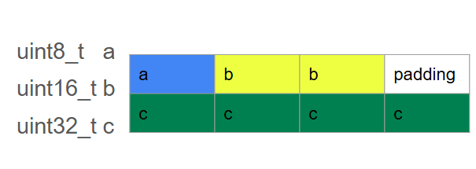
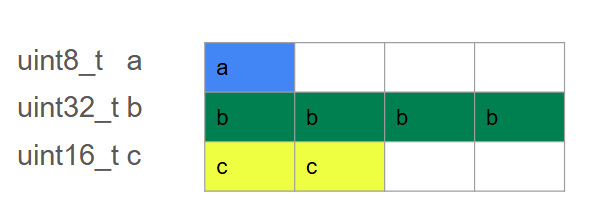

# Struc - Union

*** 1. Struct ***

struct (Structure) là một kiểu dữ liệu do người dùng định nghĩa, dùng để nhóm nhiều biến có kiểu dữ liệu khác nhau vào cùng một đơn vị.

Ví dụ:

```C
struct Example 
{
    uint8_t  a; // 1 byte  
    uint16_t b; // 2 byte
    uint32_t c; // 4 byte
};
```

Với ví dụ trên, khi cấp phát bộ nhớ thì nó sẽ cấp phát cho biến có kiểu khai báo lớn nhất (Ở đây là biến c được khai báo ``uint32_t`` - 4 Byte)



Bộ nhớ cho biến này sẽ được cấp như sau:

- Bộ nhớ cấp phát 4 byte nhưng biến a chỉ cần 1 byte nên sẽ còn 3 byte padding

- Biến b cần 2 byte và sẽ được điền vào các byte padding và ta còn 1 byte padding

- Biến c cần 4 byte và cần bộ nhớ cấp thêm 4 byte mới. Và ta sẽ còn có 1 byte padding chưa được sử dụng.

Số byte  padding cũng  sẽ bị  thay đổi nếu ta khai báo lại thứ tự các biến

```C
struct Example 
{
    uint8_t  a;    
    uint32_t b;
    uint16_t c;  
};
```



*** 2.Bit Field ***

Bit Field là một tính năng của ``struct`` cho phép quản lý và tối ưu hóa việc sử  dụng bộ nhớ bằng cách  giới hạn số lượng bit được dùng  cho mỗi  thành viên.

Bit field giúp tiết kiệm bộ nhớ, nhưng  kích  thước của struct phụ thuộc vào trình biên dịch và cách nó tối ưu hóa bộ nhớ.

Ví dụ:

```C
struct Example 
{
    int32_t flag  : 1;	// chỉ sử dụng 1 trong 32 bit
    int64_t count : 4;	// chỉ sử dụng 4 trong 64 bit
};
```

Hạn chế của Bitfield:
- Không thể lấy địa chỉ của một bit field

```C
struct Data {
    unsigned int value : 3;
};
struct Data d;
printf("%p\n", &d.value);  // ❌ Lỗi biên dịch
```

-> Do Bit Field không có địa chỉ bộ nhớ riêng.

- Không thể dùng Bit Field với kiểu ``Float`` hoặc ``Double``

- Tùy thuộc vào Compiler và kiến trúc máy:

Bit Field có thể bị sắp xếp khác nhau trên các nền tảng

Không đảm bảo khả năng tương thích giữa các hệ thống khác nhau.

*** 3. Union ***

``Union`` là kiểu dữ liệu do người dùng định nghĩa, nhưng khác với ``Struct``, các thành viên của ``Union`` dùng chung một vùng nhớ, nên kích thước của ``Union`` bằng kích thước của thành viên lớn nhất.

Ví dụ:

```C
union Data 
{
    uint8_t  a; // 1 byte
    uint16_t b; // 2 byte
    uint32_t c; // 4 byte
};
```

Các thành viên của   ``Union`` dùng chung cùng một vùng nhớ, nghĩa là tại một thời điểm chỉ có  thể lưu trữ giá trị của một thành viên

Với ví dụ trên, khi ta thay đổi dữ liệu của biến ``a`` và ``b`` thì cũng sẽ thay đổi dữ liệu trên biến lớn nhất là biến ``c``.