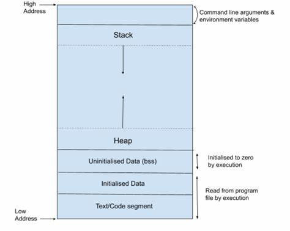

# Memory Layout

Cấu trúc của Memory Layout có dạng:



1. Text Segment (Code Segment):

- Mã máy: chứa tập hợp các lệnh thực thi.
- Quyền truy cập: Text Segment thường có quyền đọc và thực thi, nhưng không có quyền ghi. 
- Lưu hằng số toàn cục (const), chuỗi hằng - string literal (Clang – macOS, windows - minGW)
- Tất cả các biến lưu ở phần vùng Text đều không thể thay đổi giá trị mà chỉ được đọc.

Ví dụ:

```C
char arr[] = 'Hello';
```

2. Data Segment:

- Initialized Data Segment (Dữ liệu Đã Khởi Tạo):
- Chứa các biến toàn cục được khởi tạo với giá trị khác 0.
- Chứa các biến static (global + local) được khởi tạo với giá trị khác 0.
- Quyền truy cập là đọc và ghi, tức là có thể đọc và thay đổi giá trị của biến .
- Tất cả các biến sẽ được thu hồi sau khi chương trình kết thúc

Ví dụ:

```C
int a = 10;
double d = 20.5;
static int var = 5;
```

3. Bss Segment:

- Uninitialized Data Segment (Dữ liệu Chưa Khởi Tạo):
- Chứa các biến toàn cục khởi tạo với giá trị bằng 0 hoặc không gán giá trị.
- Chứa các biến static với giá trị khởi tạo bằng 0 hoặc không gán giá trị.
- Quyền truy cập là đọc và ghi, tức là có thể đọc và thay đổi giá trị của biến .
- Tất cả các biến sẽ được thu hồi sau khi chương trình kết thúc.

Ví dụ:

```C
int a = 0;
int b;

static int global = 0;

typedef struct 
{
    int x;
    int y;
} Point_Data;

static Point_Data p1 = {0,0}
```

4. Stack:

- Chứa các biến cục bộ (trừ static cục bộ), tham số truyền vào.
- Hằng số cục bộ, có thể thay đổi thông qua con trỏ.
- Quyền truy cập: đọc và ghi, nghĩa là có thể đọc và thay đổi giá trị của biến trong suốt thời gian chương trình chạy.
- Sau khi ra khỏi hàm, tự động thu hồi vùng nhớ.
- Hoạt động theo nguyên tắc: Last In, First Out (LIFO)

Ví dụ:

```C
void test()
{
    int test = 0; // Stack
    test = 5;
    printf("test: %d\n",test);
}
```

5. Heap:

Cấp phát động:
- Heap được sử dụng để cấp phát bộ nhớ động trong quá trình thực thi của chương trình.
- Điều này cho phép chương trình tạo ra và giải phóng bộ nhớ theo nhu cầu, thích ứng với sự biến đổi của dữ liệu trong quá trình chạy.
- Các hàm như malloc(), calloc(), realloc(), và free() được sử dụng để cấp phát và giải phóng bộ nhớ trên heap.

*** Malloc(): ***

- Tham số truyền vào: kích thước mong muốn ( byte)
- Giá trị trả về: con trỏ void

```C
malloc (size) // kích thước bộ nhớ cấp phát
```

```C
    size_t size = 5;

    // Sử dụng malloc
    arr_malloc = (int*)malloc(size * sizeof(int));
```

*** Realloc(): ***

Mở rộng/ thu nhỏ vùng nhớ động
- Tham số truyền vào: biến được cấp phát ptr, kích thước mong muốn ( byte)
- Giá trị trả về: con trỏ void

```C
ptr = (int *)realloc(ptr, new_size);
```

- Nếu ``new_size > old_size``, dữ liệu cũ được giữ, phần mở rộng không khởi tạo
- Nếu ``new_size < old_size``, dữ liệu có thể bị cắt bớt
- Nếu ``ptr == NULL``,  ``realloc()`` hoạt động giống ``malloc``.


*** Calloc(): ***

Cấp phát bộ nhớ cho mảng, đảm bảo tất cả phần tử = 0

- Tham số truyền vào: số lượng, kích thước của kiểu  biến ( byte)
- Giá trị trả về: con trỏ void

```C
calloc(n, size);
```

Ví dụ:

```C
#include <stdio.h>
#include <stdlib.h>

int main() {
    int *arr = (int *)calloc(5,sizeof(int));

    if (arr == NULL) {
        printf("Cấp phát bộ nhớ thất bại!\n");
        return 1;
    }

    for (int i = 0; i < 5; i++) {
        arr[i] = i + 1;
    }

    for (int i = 0; i < 5; i++) {
        printf("%d ", arr[i]);
    }

    free(arr);  // Giải phóng bộ nhớ
    return 0;
}
```