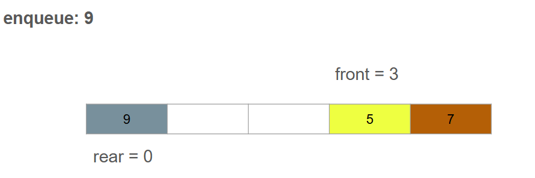

# Stack - Queue

# Stack

- Stack hoạt động cơ chế **LIFO** (Last In, First Out) - Phần tử đưa vào sau cùng sẽ được lấy ra đầu tiên

- Các thao tác chính của Stack:

+ **Push(x)**: Thêm phần tử ``x`` vào đỉnh của Stack.
+ **Pop()**: Xóa và trả về phần tử ở đỉnh của Stack.
+ **Peek()/Top()**: Trả về phần tử ở đỉnh của Stack nhưng không xóa nó.
+ **isEmpty()**: Kiểm tra Stack có rỗng không.
+ **isFull()**: Kiểm tra Stack có đầy không.

- Ứng dụng của Stack:

+ Quản lý lời gọi hàm (Call Stack) trong lập trình.
+ Kiểm tra biểu thức đúng/sai với dấu ngoặc (bracket matching).
+ Duyệt đồ thị bằng thuật toán DFS
+ Chuyển đổi biểu thức trung tố sang hậu tố.

# Queue:

Queue hoạt động theo cơ chế **FIFO** (First In, First Out) - Phẩn tử nào vào trước sẽ được xử lý trước.

- Các thao tác chính của Queue:

+ Enqueue(x): Thêm phần tử ``x`` vào cuối hàng đợi.
+ Dequeue(): Xóa và trả về phần tử ở đầu hàng đợi.
+ Front(): Trả về phần tử đầu tiên nhưng không xóa nó.
+ isEmpty(): Kiểm tra hàng đợi có rỗng không.

- Ứng dụng của Queue:
+ Hệ thống xử lý yêu cầu (Job Scheduling, CPU Scheduling)
+ Duyệt đồ thị bằng thuật toán BFS
+ Quản lý bộ nhớ đệm trong truyền dữ liệu.


# Bài tập:

Phân tích Source Code: Circular Queue

- Khởi tạo hàng đợi (Queue):

```C
// khởi tạo hàng đợi
/**
 * @brief   Khởi tạo hàng đợi.
 * @param   queue   Thông tin của hàng đợi.
 * @param   size    Số lượng phần tử tối đa của hàng đợi.
 * @return  void
 */
void queue_Init(Queue *queue, int size)
{
    queue->items = (int*)malloc(size * sizeof(int));
    queue->size  = size;
    queue->front = queue->rear = -1;
}
```

```C
    queue_Init(&queue, 5);
```

- Thêm các phần tử và giá trị vào hàng đợi:

```C
// thêm phần tử vào cuối hàng đợi
/**
 * @brief   Thêm phần tử vào cuối hàng đợi.
 * @param   queue   Thông tin của hàng đợi.
 * @param   data    Giá trị cần thêm vào hàng đợi.
 * @return  void
 */
void enqueue(Queue *queue, int data)
{
    if (queue_IsFull(*queue))
    {
        // nếu queue đầy thì không cho thêm phần tử vào
        printf("Hàng đợi đầy!\n");
    }
    else
    {
        if (queue->front == -1) // Kiểm tra điều kiện hàng đợi là rỗng
        {
            queue->front = queue->rear = 0; // Bắt đầu ở vị trí đầu tiên
        }
        else
        {
            queue->rear = (queue->rear + 1) % queue->size; // Do queue-> rear = (queue->size - 1) nên khi queue->rear tăng lên 1 và chia queue->size và lấy số dư gán lại vị trí cho queue->rear
        }
        queue->items[queue->rear] = data; // Thêm data vào vị trí queue->rear
        printf("Enqueued %d\n", data);
    }
}
```

```C
    enqueue(&queue, 10);
    enqueue(&queue, 15);
    enqueue(&queue, 20);
    enqueue(&queue, 25);
    enqueue(&queue, 30);
```

Ví dụ minh họa:

Khi đã dequeue tới vị trí queue->front = 3

Ta sử dụng hàm enqueue để add về vị trí queue->rear = 0


- Xóa phần tử ở đầu hàng đợi:

```C
// xóa phần tử từ đầu hàng đợi
/**
 * @brief   Xóa phần tử từ đầu hàng đợi.
 * @param   queue   Thông tin của hàng đợi.
 * @return  int
 */
int dequeue(Queue *queue)
{
    if (queue_IsEmpty(*queue))
    {
        // nếu queue rỗng thì không cho xóa
        printf("Hàng đợi rỗng\n");
        return QUEUE_EMPTY;
    }
    else
    {
        int dequeue_value = queue->items[queue->front]; // Gán giá trị queue->front hiện tại vào 1 biến trung gian

        if (queue->front == queue->rear && (queue->rear ==  queue->size - 1)) // Vị trí phần tử là ở vị trí cuối cùng của hàng đợi
        {
            queue->front = queue->rear = -1; // Trả về hàng đợi rỗng
        }
        else
        {
            queue->front = (queue->front + 1) % queue->size; //Gán vị trí mới cho queue->front
        }
        return dequeue_value; // Trả về giá trị vừa xóa
    }
}
```

```C
    printf("Dequeued %d\n", dequeue(&queue));
```

- Hiển thị giá trị hàng đợi:

```C
// Hiển thị các phần tử
/**
 * @brief   Hiển thị các phần tử trong hàng đợi.
 * @param   q   Thông tin của hàng đợi.
 * @return  void
 */
void display(Queue q)
{
    if (queue_IsEmpty(q)) // Kiểm tra hàng đợi Rỗng
    {
        printf("Hàng đợi rỗng\n");
        return;
    }
    printf("Hàng đợi: ");
    int i = q.front; // Trả giá trị front

    while (1) // Thực hiện vòng lặp để in các giá trị queue.rear
    {
        printf("%d ", q.items[i]);
        if (i == q.rear) break;
        i = (i + 1) % q.size; // Tăng giá trị i để có thể lấy các giá trị ở phía trước
    }
    printf("\n");
}
```

```C
    display(queue);
```